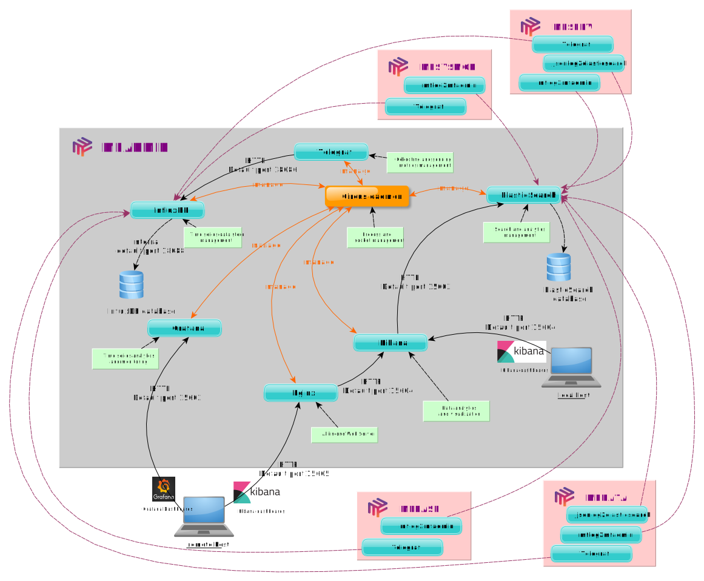

# Introduction to MFADMIN

## What is mfadmin?

MFADMIN is a Metwork module which contains **tools, libraries and dashboards** used to monitor applications (plugins) designed on Metwork.

## How it works?

MFADMIN relies on the following components :

- [Circus](https://circus.readthedocs.io/en/latest/) monitors and controls processes and sockets.
- [Grafana](http://docs.grafana.org/) allows time eries Data visualization and monitoring.
- [InfluxDB](https://docs.influxdata.com/influxdb/) manages time series data.
- [Telegraf](https://docs.influxdata.com/telegraf/) acts as a server agent for collecting and sending metrics and events from databases, systems, and IoT sensors.
- [Elasticsearch](https://www.elastic.co/products/elasticsearch) is a distributed, RESTful search and analytics engine.
- [Kibana](https://www.elastic.co/products/kibana) is a log ui for Elasticsearch.
- [Nginx](https://www.nginx.com/) acts as a web server.
- [jsonlog2elasticsearch](https://github.com/metwork-framework/jsonlog2elasticsearch) is a daemon to send json logs read from a log file to elasticsearch.
- mflog2mfadmin (based jsonlog2elasticsearch) on is a daemon to send [mflog](https://github.com/metwork-framework/mflog) to elasticsearch.
- :doc:`MFSERV <mfserv:index>` is the "webservices" MetWork module.
- :doc:`MFSYSMON <mfsysmon:index>` monitors the overall resources of the operating system on which Metwork is running.
- :doc:`MFBASE <mfbase:index>` is the storage Metwork module.
- :doc:`MFDATA <mfdata:index>` is the "incoming files processing" MetWork module.