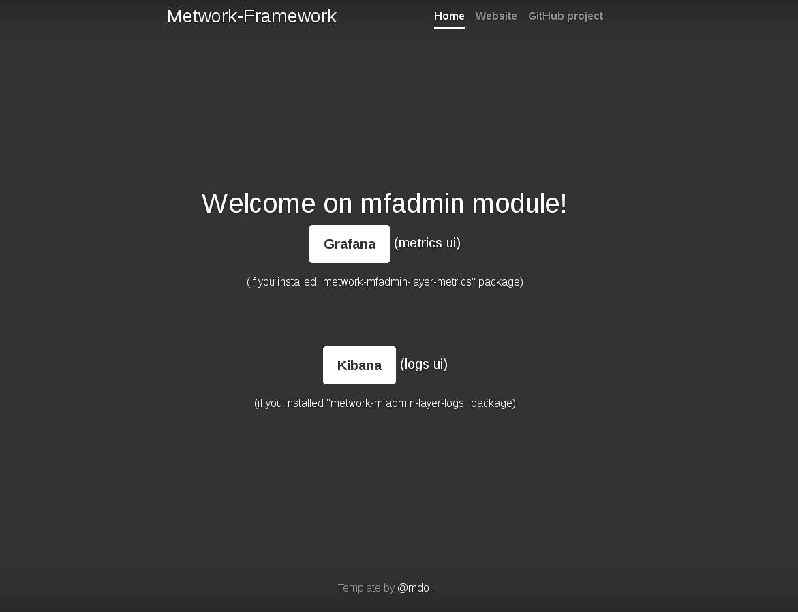
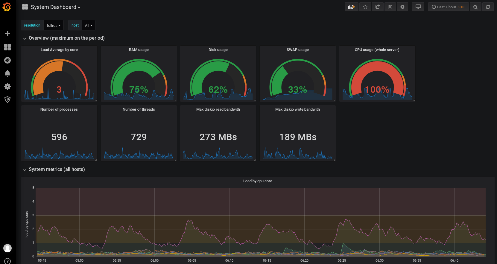
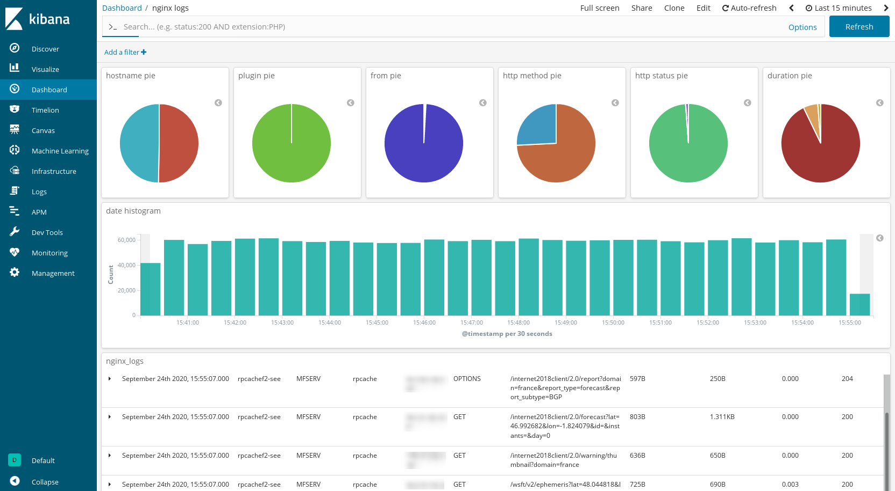

# What is MFADMIN?

This is the **M**etwork **F**ramework **ADMIN** module. This module hosts off-the-shelf software for storing and visualizing metrics and logs.

!!! important
    **It's a passive module. It does not connect to anything. You have to feed it with metrics and logs.**

For system metrics, you can install and use a **MFSYSMON** module.

For other metrics, use the corresponding MetWork module:

- **MFSERV** for http logs/metrics
- **MFDATA** for data processing logs/metrics
- [...]

And configure them to send their logs/metrics to this **MFADMIN** module (locally or through the network).

??? question "How to configure a MetWork module to send its logs/metrics to MFADMIN?"
    Open the MetWork module (*mfserv*, *mfdata*...) configuration file and have a look to the `[admin]` configuration group. In most cases, you only need to configure the `hostname` key under this group.

??? question "What about if I want to feed a **MFADMIN** from outside a MetWork module?"
    Feeding **MFADMIN** directly from outside a MetWork module **is not supported and completly discouraged**.

    To do that, you have to use an "extension point" from the **MFSYSMON** module. With this
    feature, you have send your custom logs/metrics to **MFSYSMON** and it will take care
    of communicating with **MFADMIN**.

**MFADMIN** is splitted in two optional layers:

- `metwork-mfadmin-layer-metrics`: for metrics storage ([InfluxDB](https://www.influxdata.com/products/influxdb-overview/)) and visualizing ([Grafana](https://grafana.com)).
- `metwork-mfadmin-layer-logs`: for logs storage ([ElasticSearch](FIXME)) and visualizing ([Kibana](https://www.elastic.co/fr/kibana)).

Of course, you can install the first layer, the second one or both!

!!! note "What about if I don't install any of these layers?"
    If you install **MFADMIN** module with a simple `yum install metwork-mfadmin` (or something similar),
    you get a minimal installation of **MFADMIN** module. So you don't have any extra layer. Your module
    works but is completly useless. **So be sure to add a layer for metrics, logs or both!**

** The welcome screen of **MFADMIN** with two choices: *metrics ui* or *logs ui* **

** A "system" dashboard in the *metrics ui* provided with **MFADMIN** (of course, you can build/use your custom dashboards but we provide some interesting dashboards out of the box). **

** A "nginx logs" dashboard in the "logs ui" provided with **MFADMIN** (of course, you can build/use your custom dashboards but we provide some interesting dashboards out of the box). **

