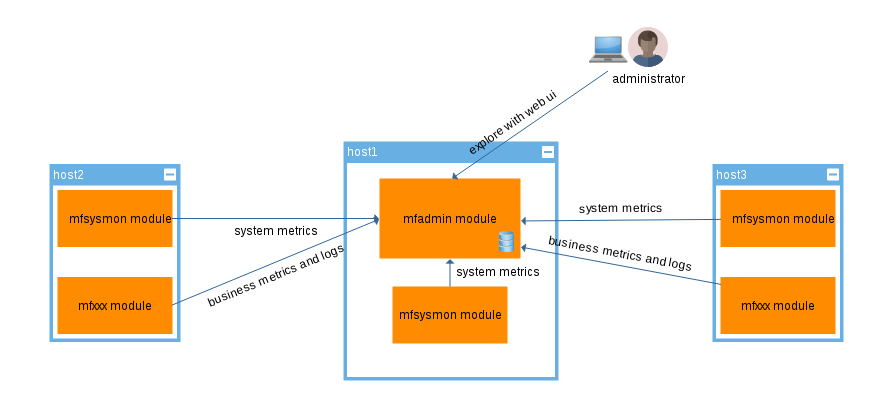
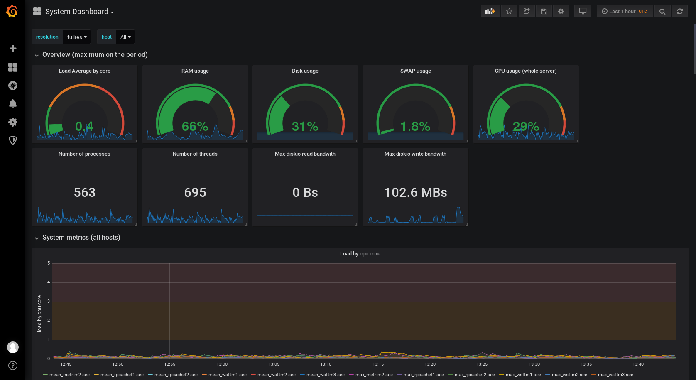
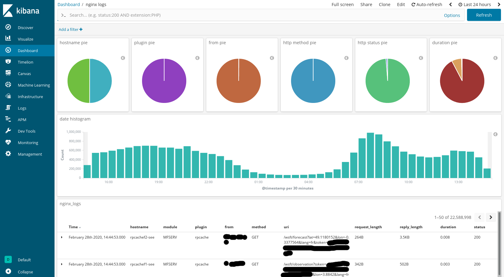

# What is it?

**MFADMIN** is the **M**etwork **F**ramework **ADMIN** module.

!!! note
    This historical name is not great as it is more a *monitoring* module than an *admin* module.

This module runs server software:

- to store and explore **metrics** (with [InfluxDB](https://docs.influxdata.com/influxdb/) as a database and [Grafana](http://docs.grafana.org/) as a web UI)
- to store and explore **logs** (with [Elasticsearch](https://www.elastic.co/products/elasticsearch) as a database and [Kibana](https://www.elastic.co/products/kibana) as a web UI)

As these two main features are implemented with different software stacks, you can
choose to use **MFADMIN** only for **logs**, only for **metrics** or for both.

??? note "How to install?"
    - to install and use **metrics** subsystem, just install the `metwork-mfadmin-layer-metrics` package with your favorite package manager
    - to install and use **logs** subsystem, just install the `metwork-mfadmin-layer-logs` package with your favorite package manager
    - additional notes: the `metwork-mfadmin` minimal virtual-package install none of them and the `metwork-mfadmin-full` virtual-package install both

**MFADMIN** is a passive module. It stores things and provides ready to use dashboards but it has to be fed (with metrics and/or logs) by other modules.

In most configuration, you will deploy only one **MFADMIN** instance. This instance will be fed
by plenty of other modules/nodes.

The easiest way to start to feed your freshly installed **MFADMIN** instance is to install a [MFSYSMON](https://metwork-framework.org/mfsysmon) module on the same host to collect and send
system metrics.

??? note "If you install mfsysmon on another host?"
    **MFSYSMON** module collect system metrics locally and (by default) send them to the same host. So it will work "out of the box" if you install **MFSYSMON** and **MFADMIN** on the same host.

    But it's really easy to reconfigure a **MFSYSMON** module to send metrics to a **MFADMIN**
    module installed on another host. It's a really common scenario.

*(Typical deployment of mfadmin module)*

*(Out of the box dashboard for "system metrics")*

*(Out of the box dashboard for "http logs")*
