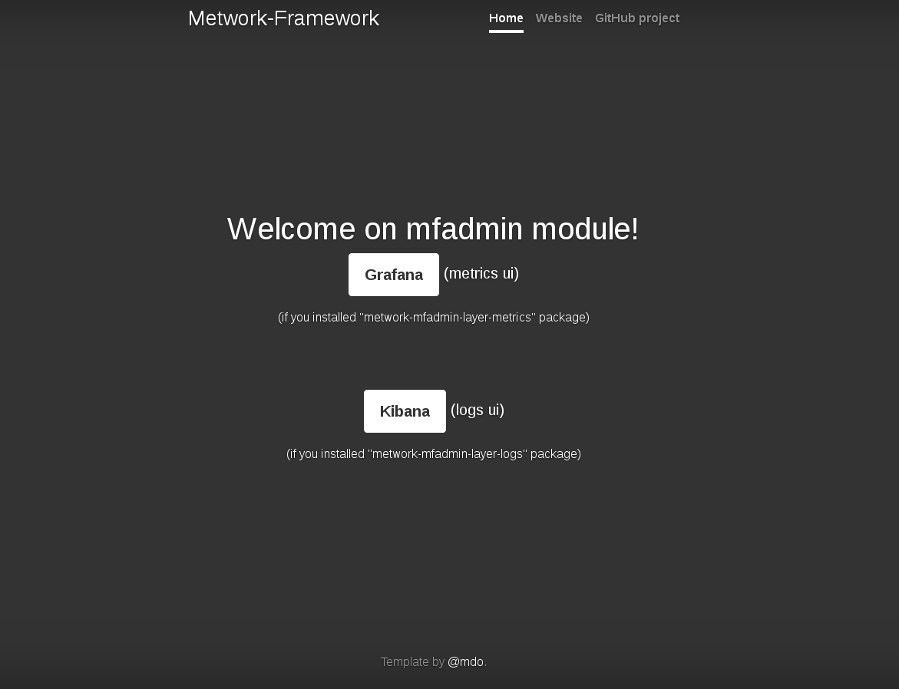

# Quickstart

## Installation

**On a Linux CentOS 6, 7 or 8 box**

??? question "What about other Linux distributions?"
    This quickstart is easily adaptable to other Linux distributions. To install
        on your favorite one, have a look at the [complete installation guide]({{installation_guide}}).

```bash
# AS root USER

# First, we configure the Metwork Framework repository for 1.0 releases
cat >/etc/yum.repos.d/metwork.repo <<EOF
[metwork_1.0]
name=MetWork 1.0
baseurl=http://metwork-framework.org/pub/metwork/releases/rpms/release_1.0/portable/
gpgcheck=0
enabled=1
metadata_expire=0
EOF

# Then we install the full version of mfadmin module
# (full to get the support of metrics and logs)
yum -y install metwork-mfadmin-full

# Let's start Metwork services
# (or "systemctl start metwork.service" if you don't have the "service" command)
service metwork start

# Done :-)
```

## Test

Open a browser on [http://127.0.0.1:15605](http://127.0.0.1:15605). You should get:



## Metrics

Click on "Grafana" on latest screen to get access to the `Grafana` software.

??? question "default account/password?"
    The default username is `admin`. The default password is `admin` (you can change it in your module configuration file).

Then, for example, in the "Dashboard selection dropdown list" in top/left
(initially you are on the "home" dashboard), choose "System Dashboard" to have
something like that (without all metrics probably):


To feed your MFADMIN with some system metrics, have a look to the MFSYSMON module
to configure this.

## Logs

In welcome screen, click on "Kibaba" to get access to the `Kibana` software.

??? question "default account/password?"
    The default username is `admin`. The default password is `admin` (you can change it in your module configuration file).

Then, for example click on Dashboard (in the left menu bar) then choose a dashboard...
