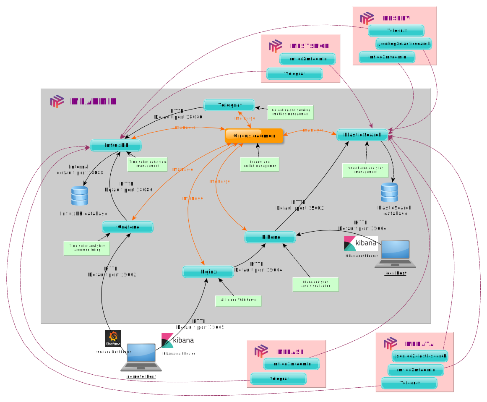

# Introduction to MFADMIN

## What is mfadmin?

MFADMIN is a Metwork module which contains **tools, libraries and dashboards** used to monitor applications (plugins) designed on Metwork.

## How it works?

**MFADMIN relies on the following components:**

- [Circus](https://circus.readthedocs.io/en/latest/) monitors and controls processes and sockets. Circus acts as a process watcher and runner. You may check the full `circus.ini` configuration file in the directory `tmp/config_auto/` in the root directory of the `mfadmin` user. Check the [Circus architecture](https://circus.readthedocs.io/en/latest/design/architecture/).
- [Grafana](http://docs.grafana.org/) allows time series data visualization and monitoring.
- [InfluxDB](https://docs.influxdata.com/influxdb/) manages time series data.
- [Telegraf](https://docs.influxdata.com/telegraf/) acts as a server agent for collecting and sending metrics and events from databases, systems, and IoT sensors.
- [Elasticsearch](https://www.elastic.co/products/elasticsearch) is a distributed, RESTful search and analytics engine.
- [Kibana](https://www.elastic.co/products/kibana) is a log ui for Elasticsearch.
- [Nginx](https://www.nginx.com/) acts as a web server.
- [jsonlog2elasticsearch](https://github.com/metwork-framework/jsonlog2elasticsearch) is a daemon to send json logs read from a log file to elasticsearch.
- mflog2mfadmin (based on jsonlog2elasticsearch) is a daemon to send [mflog](https://github.com/metwork-framework/mflog) to elasticsearch.
- [MFSERV](../../../mfserv/) is the "webservices" MetWork module.
- [MFSYSMON](../../../mfsysmon/) monitors the overall resources of the operating system on which Metwork is running.
- [MFBASE](../../../mfbase/) is the storage Metwork module.
- [MFDATA](../../../mfdata/) is the "incoming files processing" MetWork module.

- See also:
    - [Sending StatsD Metrics to Telegraf & InfluxDB](https://www.influxdata.com/blog/getting-started-with-sending-statsd-metrics-to-telegraf-influxdb/)
    - [StatsD : a simple protocol for sending application metrics via UDP](https://github.com/statsd/statsd)
    - [Telegraf StatsD input plugin](https://github.com/influxdata/telegraf/tree/master/plugins/inputs/statsd)
    - [Circus hooks](../mfadmin_miscellaneous/#27-circus-hooks)

## MFADMIN configuration

The configuration of the MFADMIN and its components is stored in the `config/config.ini` file of the root directory of the `mfadmin` user. Check this file for further information.

<!--
Intentional comment to prevent m2r from generating bad rst statements when the file ends with a block .. xxx ::
-->
