# Monitoring MetWork plugins

This section shows how to configure MetWork modules so that you can monitor your plugin and display dashboards through the [tools offered in MFADMIN](../mfadmin_intro/#2-how-it-works):

!!! info "See also [Create specific dashboards](../mfadmin_miscellaneous/#1-create-specific-dashboards`)"

## Configuration

In order to monitor MetWork plugins, you have first to:

- install Metwork MFADMIN and MFSYSMON modules
- configure the `[admin]` section and, optionally the `[log]` section of the `config/config.ini` in the root directory of the MetWork module (i.e. MFDATA, MFSERV, MFBASE,...), 

!!! important
    **When you change a Metwork module configuration, you have to restart the corresponding Metwork module service (MFDATA, MFSERV, MFBASE, ...)**, e.g:
    
    ```bash
    service metwork restart mfdata
    ```

### Enable monitoring

To tell you want to monitor your plugins, first, set the `hostname` parameter value with the host name or IP address where MFADMIN is running:

```cfg
[admin]
# null => no monitoring
# hostname=null
# By setting hostname = localhost, we assume MFADMIN is running on the same Linux machine, 
# if MFADMIN is running on a different machine, set hostname = {your_host_name} or {your_host_ip_address}
hostname=localhost
# influxdb_http_port=18086
...
```
!!! important
    If the above `hostname` parameter is not set or set to `null`, **no monitoring** will be available and **no data** will be displayed in the [Grafana dashboards](#2-grafana-time-series-dashboards) and [Kibana dashboards](#3-kibana-dashboards).
     
**By setting** `hostname`, **this will enable monitoring and the time-series metrics (by default)**. The metrics will be stored in the `InfluxDB` databases of the [MFADMIN host](../mfadmin_intro/#how-it-works). The corresponding dashboards will be available through `Grafana` on the [MFADMIN host](../mfadmin_intro/#how-it-works).

### Enable monitoring based on standard logs and mflog logs 

Now, if you want to monitor your plugins through [mflog](https://github.com/metwork-framework/mflog) logs, in addition you have to set in the `[log]` section of the `config/config.ini`, the following parameters:

- the `send_mflog_logs` parameter to `1`
- the `json_file` parameter to `AUTO`
- the `json_minimal_level` parameter to the desired level

```cfg
[log]
...
# If send_mflog_logs=1, send mflog logs to the configured admin hostname
send_mflog_logs=1

# duplicate some log messages in JSON to a specific file (for external monitoring tool)
# If json_file value is:
# null => the feature is desactivated
# AUTO => the json_file is @@@MFMODULE_RUNTIME_HOME@@@/log/json_logs.log if
#         [admin]/hostname != null else null (desactivated)
json_file=AUTO

# Minimal level for this json log file
# (DEBUG => everything,
#  INFO => everything but not DEBUG,
#  WARNING => everything but not DEBUG and INFO,
#  ERROR => everything but not DEBUG, INFO and WARNING,
#  CRITICAL => everything but not DEBUG, INFO, WARNING AND ERROR)
json_minimal_level=DEBUG
...

```

**This will enable the standard logs and mflog logs** to be stored in the `ElasticSearch` database of the [MFADMIN host](../mfadmin_intro/#how-it-works). The corresponding dashboards will be available through `Kibana` on the [MFADMIN host](../mfadmin_intro/#how-it-works).

In the above example, `DEBUG` logs will be duplicated (JSON format) in the `log/json_logs.log` file (in the root directory of the MetWork module user, e.g.`mfadmin`).

Notice the `json_minimal_level` parameter has nothing to do with the `minimal_level` parameter. This allows you monitoring plugins by filtering logs with a different level.

!!! important
    If [monitoring is not enabled](#11-enable-monitoring), the above configuration will have no effect.


!!! tip ""
    With [mflog](https://github.com/metwork-framework/mflog), you may add some attributes to the logger (refer to [mflog example](https://github.com/metwork-framework/mflog/#what-is-it-)). These attributes will be logged and may be displayed in the [Kibana dashboards](../mfadmin_monitoring_plugins/#3-kibana-dashboards).

### Enable monitoring based on nginx access logs 

!!! note
    **This section applies only on MetWork modules which embed nginx**

If you want to monitor the **nginx access logs**, you have to configure the `send_nginx_logs` parameter in the the `[log]` section of the `config/config.ini` :

```cfg
[log]
...
# If send_nginx_logs=1, send nginx access logs to the configured admin hostname
send_nginx_logs=1
...
```

**This will enable the nginx access logs** to be stored in the `ElasticSearch` database of the [MFADMIN host](../mfadmin_intro/#2-how-it-works). The corresponding dashboards will be available through `Kibana` on the [MFADMIN host](../mfadmin_intro/#2-how-it-works).

!!! important
    If [monitoring is not enabled](#11-enable-monitoring), the above configuration will have no effect.


## Grafana Time-series dashboards

Grafana dashboards are available from MFADMIN `Grafana GUI Interface` which is displayed through HTTP on `http://{your_mfadmin_host}:15602`(default login is `admin/admin`), e.g. `http://localhost:15602`.

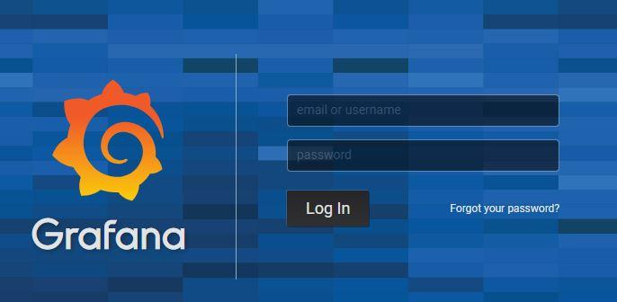

Then, click on the module you want display dashboards.

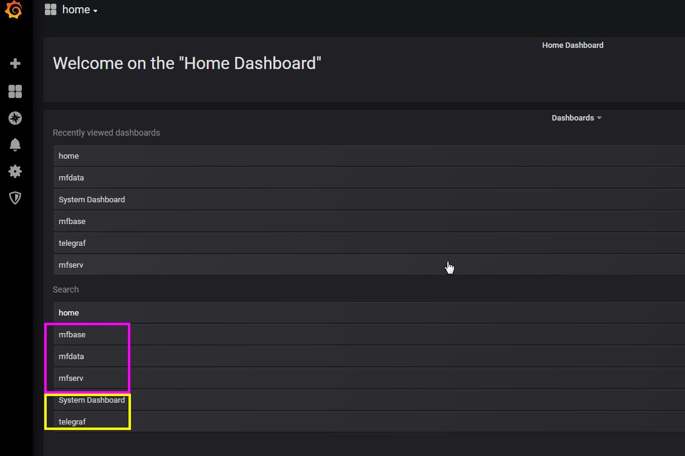

- Some default MFDATA dashboards:

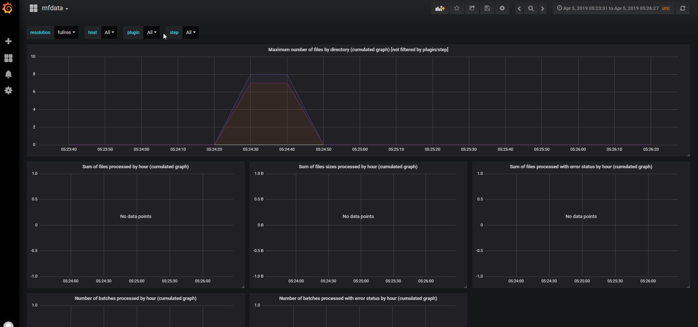

- Some default MFBASE dashboards:

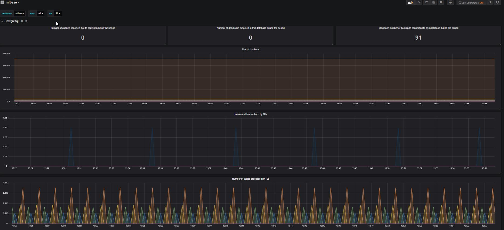


!!! important
    Grafana dashboards have a `resolution` parameter (`retention policies`). 
    You can choose which resolution to display. See [InfluxDB retention policies and statistics aggregator](../mfadmin_miscellaneous/#251-influxdb-retention-policies-and-statistics-aggregator) for more details.

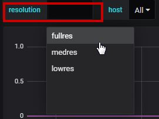

!!! tip ""
    You may want to implement your own dashboard with specific metrics. In order to do this, you may refer to [Create specific dashboards](../mfadmin_miscellaneous/#1-create-specific-dashboards) and [Implement custom monitoring and metrics in a plugin](../../../mfdata_additional_tutorials/#5-implement-custom-monitoring-and-metrics-in-a-plugin).


!!! tip ""
    You can implement your own dashboard from ElasticSearch database. 
    By default ElasticSearch [mflog](https://github.com/metwork-framework/mflog) logs and ElasticSearch **nginx access logs** datasources are configured in Grafana.
    When you create your Grafana query, select either the `es_mflog` or `es_nginx` datasource in the `Queries to` field.
    
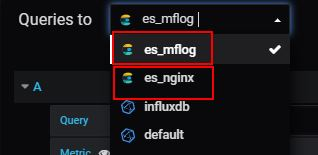

!!! info "See also:"
    - [Grafana documentation](https://grafana.com/docs/)
    - [Grafana - Getting started guide](https://grafana.com/docs/grafana/latest/getting-started/getting-started/)
    - [Using InfluxDB in Grafana](https://grafana.com/docs/features/datasources/influxdb) 
    - [Using Elasticsearch in Grafana](https://grafana.com/docs/features/datasources/elasticsearch)

## Kibana dashboards

Kibana dashboards are available from MFADMIN `Kibana GUI Interface` which is displayed through HTTP on `http://{your_mfadmin_host}:15605` from a remote host and also `http://localhost:156054` from the MFADMIN local host. The default login is `admin/admin`.


After you logged in to Kibana, click the `Dashboard` menu to select available dashboards to display.

The default dashboards provided by MetWork are:

- [mflog logs](#12-enable-monitoring-based-on-standard-logs-and-mflog-logs)
- [nginx logs](#13-enable-monitoring-based-on-nginx-access-logs)

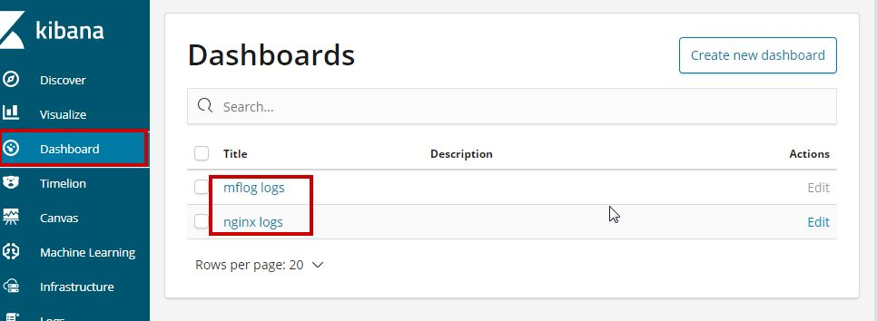


### mflog logs dashboards example

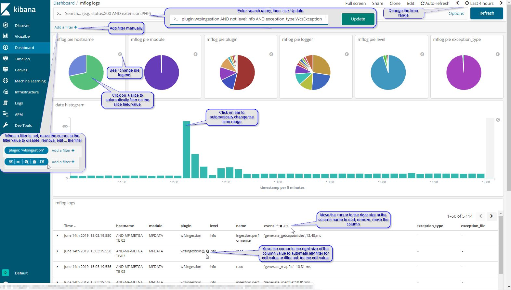

### nginx logs dashboards example

[nginx logs](#13-enable-monitoring-based-on-nginx-access-logs) dashboards are similar to [mflog logs](#12-enable-monitoring-based-on-standard-logs-and-mflog-logs) dashboards, except data displayed.

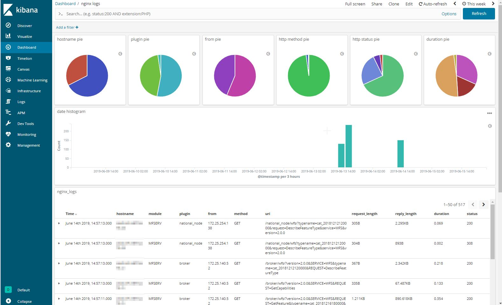

### Editing a Kibana dashboard visualization

In this section:

- we will add some attributes to the logger of the [move_image](../../../mfdata/950-old_docs/mfdata_quick_start/#21-create-the-plugin) plugin, based on the [mflog example](https://github.com/metwork-framework/mflog/#what-is-it-)
- we will edit a Kibana `mflog logs` dashboard visualization in order to add the added attributes to be displayed.

Edit the `main.py` script of the [move_image](../../../mfdata/950-old_docs/mfdata_quick_start/#21-create-the-plugin) plugin, and change as following:

```python
#!/usr/bin/env python3

from acquisition import AcquisitionMoveStep
from mflog import get_logger


class Move_imageMoveMainStep(AcquisitionMoveStep):

    plugin_name = "move_image"
    step_name = "main"
    log = get_logger("move_image")
    log = log.bind(user="john")
    log = log.bind(user_id=123)

    def process(self, xaf):
        self.log.warning("user logged in", happy=True, another_key=42)
        return super().process(xaf)


if __name__ == "__main__":
    x = Move_imageMoveMainStep()
    x.run()


```
Then, run the plugin.

Open the MFADMIN Kibana GUI Interface and display the `mflog logs` dashboard.

In the menu bar, click **Edit**.

To edit a visualisation of a panel, click the **gear icon** in the upper right. So, click the **gear icon** in the upper right of the `mflog logs` panel:, then click `edit visualization`:

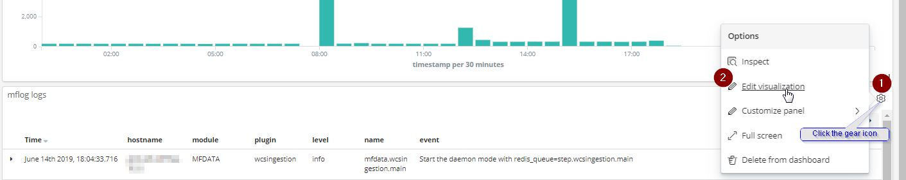

Add the attributes:
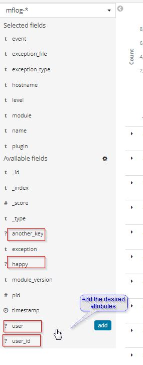

Click **Save** in the menu bar, and enter a new name, e.g. **mflog logs custom**

Add filters: `plugins:"move_image"` and `level:"warning"`:

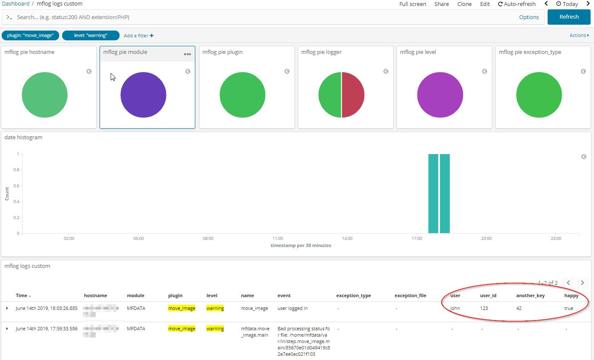

!!! info "See also"
    For further, refer to [Kibana documentation](https://www.elastic.co/guide/en/kibana/current)


!!! note
    You may edit any Kibana dashboards, either data table or graphs.
    
<!--
Intentional comment to prevent m2r from generating bad rst statements when the file ends with a block .. xxx ::
-->
